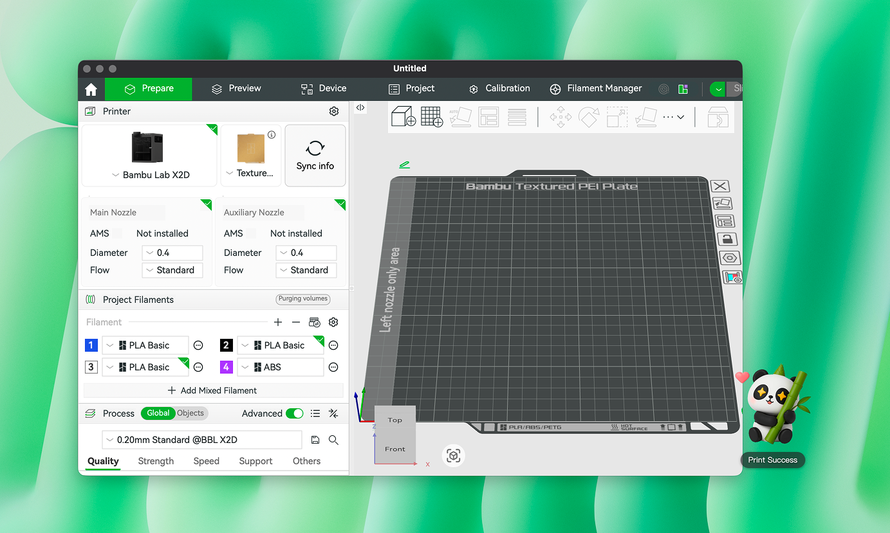
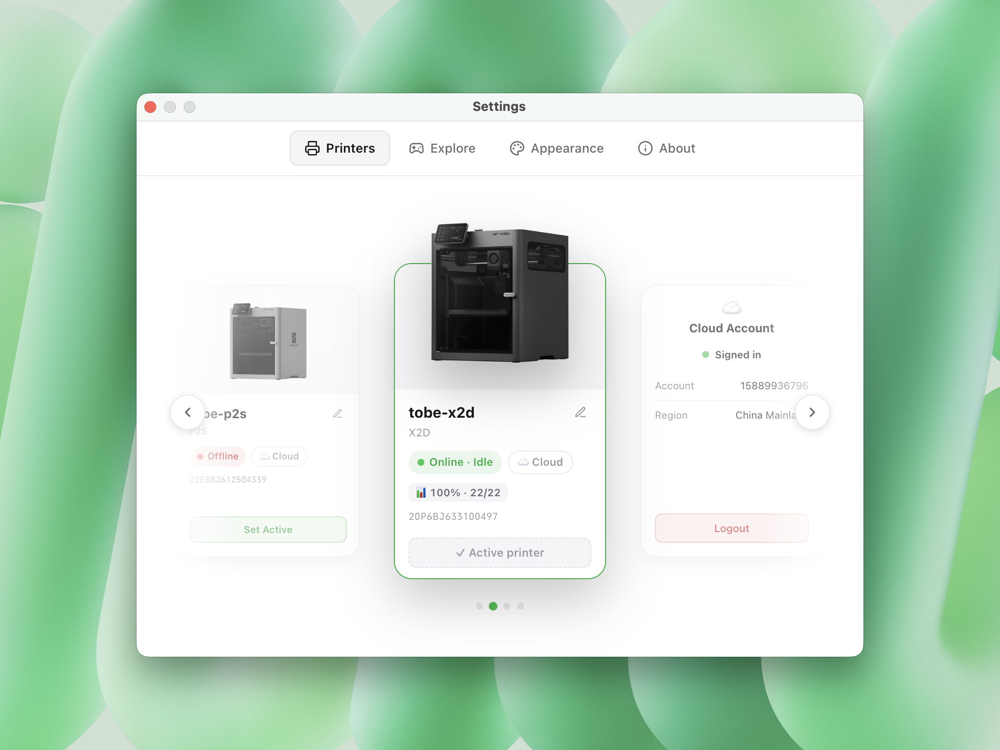

# Bambu Buddy 🐼

English | <a href="README.zh-CN.md">简体中文</a>

**A desktop pet panda that lives on your screen and reacts to your Bambu Lab 3D printer.**

Unofficial community project — not affiliated with or endorsed by Bambu Lab.

### [⬇️ Download for macOS / Windows](https://github.com/YingyiDai/bambu-buddy/releases/latest)

---

## What is it?

Bambu Buddy turns your printer's status into a little animated panda that lives on your desktop. It's transparent, always-on-top, draggable, and click-through — it stays out of your way in the corner, using expressions and motion to tell you how your print is going: started, swapping filament, finished, or failed. One glance and you know — no need to open Bambu Studio or Bambu Handy.

---

## ✨ Features

- 🐼 **Reacts in real time** — the panda's animation and status text change instantly when the printer's state changes.
- 🎬 **11 hand-crafted moods** — from idle and printing to filament change, success, and failure, each with its own expression.
- 🖨️ **Cloud & LAN** — sign in with your Bambu account, including **Google / Apple / Facebook** accounts (login happens on the official Bambu page — your password never touches this app), or connect directly via IP + access code on your local network.
- 🔀 **Multi-printer** — cloud and local printers merge into one list, switch from the tray menu.

---

## 🐼 The panda's moods

<table align="center">
  <tr>
    <td align="center"> <b>Idle</b> Printer is idle</td>
    <td align="center"> <b>Preparing</b> Heating / leveling / calibration</td>
    <td align="center"> <b>Printing</b> 4 stages by progress</td>
    <td align="center"> <b>Changing filament</b> Load / unload / AMS</td>
  </tr>
  <tr>
    <td align="center"> <b>Paused</b> Manual or error pause</td>
    <td align="center"> <b>Finished 🎉</b> Print succeeded</td>
    <td align="center"> <b>Failed</b> Error / HMS code</td>
    <td align="center"> <b>Offline</b> Disconnected or login expired</td>
  </tr>
</table>

---

## 📥 Download & Install

### macOS

1. Download the latest `.dmg` from **[Releases](https://github.com/YingyiDai/bambu-buddy/releases/latest)** (Apple Silicon / arm64).
2. Open the DMG and drag **Bambu Buddy** into Applications.
3. Launch **Bambu Buddy** — it's Apple-signed (Developer ID) and notarized, so it opens normally with no security warning.

### Windows

1. Download the latest `.exe` installer from **[Releases](https://github.com/YingyiDai/bambu-buddy/releases/latest)**.
2. Run the installer. If Windows SmartScreen warns that the publisher is unrecognized — the app isn't code-signed yet — click **More info › Run anyway**.

---

## 🔌 Connect your printer

| Mode | How |
|---|---|
| 🎮 **Playground** | No printer needed — click through every state in the Playground, or auto-cycle. |
| ☁️ **Bambu Cloud** | Sign in with your Bambu account — email/password and Google / Apple / Facebook are all supported via the official Bambu sign-in page. Cloud printers sync automatically and subscribe to live status via MQTT. |
| 🏠 **LAN** | Enter the printer's IP + access code (shown on the printer's screen) to connect directly on your local network. |

---

## ❓ FAQ

**Does it send my data anywhere?**
No. Account credentials are encrypted locally with your OS keychain (macOS Keychain / Windows DPAPI via Electron `safeStorage`) and only used to connect to your own printer — nothing is sent to any third-party server.

**How do I update?**
Click "Check for updates" from the tray menu or Settings › About — it compares against the latest GitHub Release and offers a one-click jump to download.

**No Bambu printer?**
That's fine — Playground mode exists for exactly that, so you can enjoy the panda's animations on their own.

---

Made with 🐼 for the Bambu Lab community

